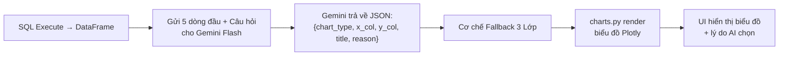
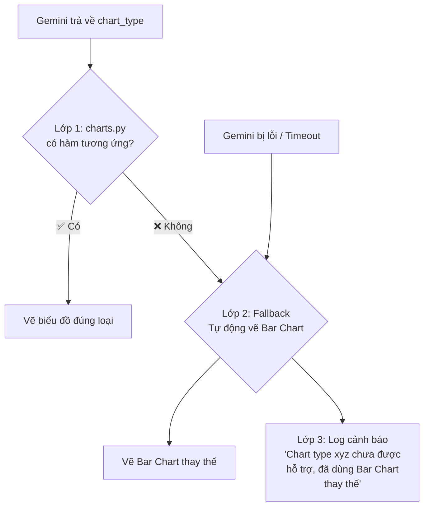

# 🎨 Visualization Engine — AI Chọn Biểu Đồ (Gemini Flash)

## Mục tiêu

Thay vì rule-based (if-else), dùng **Gemini Flash** làm "Chuyên gia Data Analyst" — phân tích cấu trúc dữ liệu + câu hỏi của user → Tự chọn loại biểu đồ phù hợp nhất. Độ chính xác ~99%.

---

## Kiến trúc tổng quan



---

## 🛡️ Cơ chế Fallback 3 Lớp (Không bao giờ crash)

Đây là lớp phòng thủ đảm bảo user **LUÔN LUÔN** thấy biểu đồ, dù bất kỳ lỗi gì xảy ra:



| Lớp | Tình huống | Hành động |
|---|---|---|
| **Lớp 1** | Gemini chọn đúng loại có trong `charts.py` (VD: `line`) | ✅ Vẽ biểu đồ đúng loại |
| **Lớp 2** | Gemini chọn loại chưa code (VD: `radar`) HOẶC Gemini bị lỗi/timeout | ⚠️ Tự động vẽ **Bar Chart** (loại an toàn nhất, hoạt động với mọi dữ liệu) |
| **Lớp 3** | Song song với Lớp 2 | 📝 Ghi log cảnh báo: `"Chart type 'radar' chưa được hỗ trợ, đã dùng Bar Chart thay thế"` |

### Pseudocode cơ chế Fallback:

```python
def render(chart_config: dict, df: pd.DataFrame):
    chart_type = chart_config.get("chart_type", "bar")
    
    # Lớp 1: Tìm hàm vẽ tương ứng
    chart_functions = {
        "bar": create_bar_chart,
        "horizontal_bar": create_horizontal_bar,
        "line": create_line_chart,
        "pie": create_pie_chart,
        # ... 12 loại
    }
    
    render_func = chart_functions.get(chart_type)
    
    if render_func:
        # ✅ Lớp 1: Có hàm → Vẽ luôn
        return render_func(df, chart_config)
    else:
        # ⚠️ Lớp 2: Không có hàm → Fallback về Bar Chart
        # 📝 Lớp 3: Log cảnh báo
        logger.warning(f"Chart type '{chart_type}' chưa được hỗ trợ, đã dùng Bar Chart thay thế.")
        return create_bar_chart(df, chart_config)
```

> **Tại sao chọn Bar Chart làm Fallback?**  
> Vì Bar Chart là loại biểu đồ "vạn năng" — nó hoạt động đúng với MỌI dạng dữ liệu (số, text, thời gian, 1 dòng hay 100 dòng). Không bao giờ crash, không bao giờ vô nghĩa.

---

## 12 Loại Biểu Đồ Được Hỗ Trợ

### 🔴 Nhóm Cốt Lõi (5 loại — Bắt buộc có)

| # | `chart_type` | Tên | Khi nào AI chọn | Ví dụ câu hỏi |
|---|---|---|---|---|
| 1 | `bar` | Cột dọc | So sánh ≤ 10 danh mục | "Top 5 sản phẩm bán chạy" |
| 2 | `horizontal_bar` | Thanh ngang | So sánh > 10 mục hoặc tên dài | "Doanh thu 20 cửa hàng" |
| 3 | `line` | Đường | Xu hướng theo thời gian | "Doanh thu theo từng tháng" |
| 4 | `pie` | Tròn (Donut) | Cơ cấu %, mọi giá trị > 0, ≤ 8 mục | "Cơ cấu doanh thu theo khu vực" |
| 5 | `kpi_card` | Thẻ KPI | Kết quả chỉ 1 con số duy nhất | "Tổng doanh thu là bao nhiêu?" |

### 🟡 Nhóm Nâng Cao (5 loại — Nên có để demo ấn tượng)

| # | `chart_type` | Tên | Khi nào AI chọn | Ví dụ câu hỏi |
|---|---|---|---|---|
| 6 | `stacked_bar` | Cột chồng | Cơ cấu bên trong từng nhóm | "Doanh thu theo khu vực, chia theo loại SP" |
| 7 | `grouped_bar` | Cột ghép nhóm | So sánh nhiều metric song song | "So sánh doanh thu vs chi phí theo tháng" |
| 8 | `area` | Vùng | Xu hướng tích lũy | "Doanh thu cộng dồn theo tháng" |
| 9 | `scatter` | Phân tán | Tương quan 2 biến số | "Mối liên hệ giữa giá bán và số lượng" |
| 10 | `heatmap` | Bản đồ nhiệt | Ma trận 2 chiều | "Doanh thu theo Tháng × Khu vực" |

### 🟢 Nhóm Bonus (2 loại — "Chơi lớn" ngang Tableau)

| # | `chart_type` | Tên | Khi nào AI chọn | Ví dụ câu hỏi |
|---|---|---|---|---|
| 11 | `treemap` | Bản đồ cây | Phân tầng (hierarchical) | "Phân bổ doanh thu: Khu vực → Tỉnh" |
| 12 | `waterfall` | Thác nước | Phân tích tài chính cộng/trừ | "Doanh thu - Chi phí = Lợi nhuận" |

---

## Proposed Changes (5 files)

### 1. [NEW] recommender.py

**Core Logic:** Gọi Gemini Flash với Prompt chuyên biệt, truyền vào:
- Câu hỏi gốc của user
- NLU Intent (TREND, RANKING, COMPARISON...)
- Danh sách cột + kiểu dữ liệu (text/number/date)
- 5 dòng dữ liệu đầu tiên (làm mẫu)

**Output:** `ChartConfig` dict:
```json
{
  "chart_type": "bar | horizontal_bar | line | pie | kpi_card | stacked_bar | grouped_bar | area | scatter | heatmap | treemap | waterfall",
  "x_column": "Region",
  "y_column": "TotalRevenue", 
  "color_column": null,
  "title": "Doanh thu theo Khu vực",
  "reason": "Dữ liệu so sánh 4 khu vực, Bar Chart phù hợp nhất"
}
```

---

### 2. [NEW] charts.py

12 hàm sinh biểu đồ Plotly. Tất cả dùng theme nhất quán: bảng màu đẹp, font tiếng Việt, responsive.

---

### 3. [MODIFY] prompts.yaml

Thêm prompt mới `viz_recommender_prompt` cho Gemini với đầy đủ 12 loại biểu đồ và quy tắc chọn.

---

### 4. [MODIFY] main.py

Sau bước CLS masking, gọi `VizRecommender.suggest()`, gắn `chart_config` vào response.

---

### 5. [MODIFY] ui.py

Thay toàn bộ logic biểu đồ thô bằng render từ `chart_config` + hiển thị lý do AI chọn.

---

## Mở rộng trong tương lai

Nếu sau này muốn thêm loại biểu đồ mới (VD: `radar`, `sankey`, `sunburst`...), chỉ cần:

1. ✏️ Thêm **1 hàm** vào `charts.py` (VD: `create_radar_chart()`)
2. ✏️ Thêm **1 dòng mô tả** vào Prompt trong `prompts.yaml`

Không cần sửa bất kỳ logic nào khác. Cơ chế Fallback 3 Lớp tự động xử lý mọi thứ.

---

## Verification Plan

| Câu hỏi test | Biểu đồ AI nên chọn |
|---|---|
| "Tổng doanh thu là bao nhiêu?" | 💰 KPI Card |
| "Doanh thu theo từng tháng năm 2024" | 📈 Line Chart |
| "Top 5 sản phẩm bán chạy nhất" | 📊 Bar Chart |
| "Cơ cấu doanh thu theo khu vực" | 🥧 Pie Chart |
| "Doanh thu của 20 cửa hàng" | 📊 Horizontal Bar |
| "So sánh doanh thu vs chi phí theo quý" | 📊 Grouped Bar |
| "Doanh thu theo khu vực, chia theo loại sản phẩm" | 📊 Stacked Bar |
| "Xu hướng doanh thu tích lũy theo tháng" | 📈 Area Chart |
| "Mối liên hệ giữa giá bán và số lượng bán" | 🔵 Scatter Plot |
| "Doanh thu theo Tháng và Khu vực (ma trận)" | 🟧 Heatmap |

> [!IMPORTANT]
> Gemini Flash gọi qua OpenRouter miễn phí, response < 1 giây. Nếu Gemini lỗi → Cơ chế Fallback 3 Lớp đảm bảo KHÔNG BAO GIỜ crash, user LUÔN thấy biểu đồ.
